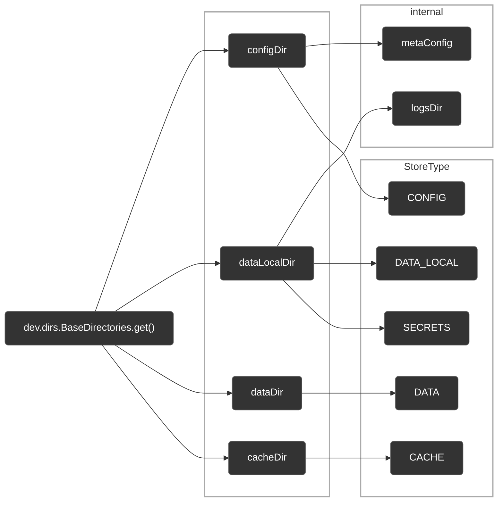

# System Storage Lib

A Minecraft library mod that provides **system-level persistent storage** for other mods, featuring cross-process file locking, encrypted credential storage, and adherence to platform-specific data directory conventions.

### Design Principles

- **Come and go**: Ensure users can cleanly delete all files stored by this library mod within the system
- **Disk-Aware Placement**: Allow customization of storage locations for large-volume data to prevent excessive consumption of system partition space

System Storage Lib obtains system standard directories (`configDir`, `dataDir`, etc.) from [directories-jvm](https://github.com/dirs-dev/directories-jvm), then divides them into five storage directories by `StoreType`, plus two internal directories: `metaConfig` (global configuration) and `logsDir` (logs). All paths are determined when constructing the `SystemStorageLib` singleton and cannot be customized.

> [!Warning]
>
> This is currently an unstable, unofficial release. The API is subject to breaking changes at any time.

> [!Tip]
>
> This documentation is intended to guide developers on how to use System Storage Lib, rather than exhaustively enumerating every API detail. Only key API methods are presented herein; please consult the source code for comprehensive details.

---

- **License**: [MIT License](https://github.com/Leawind/SystemStorageLib/blob/main/LICENSE)
- **Source Code**: [GitHub - Leawind/SystemStorageLib](https://github.com/Leawind/SystemStorageLib)
