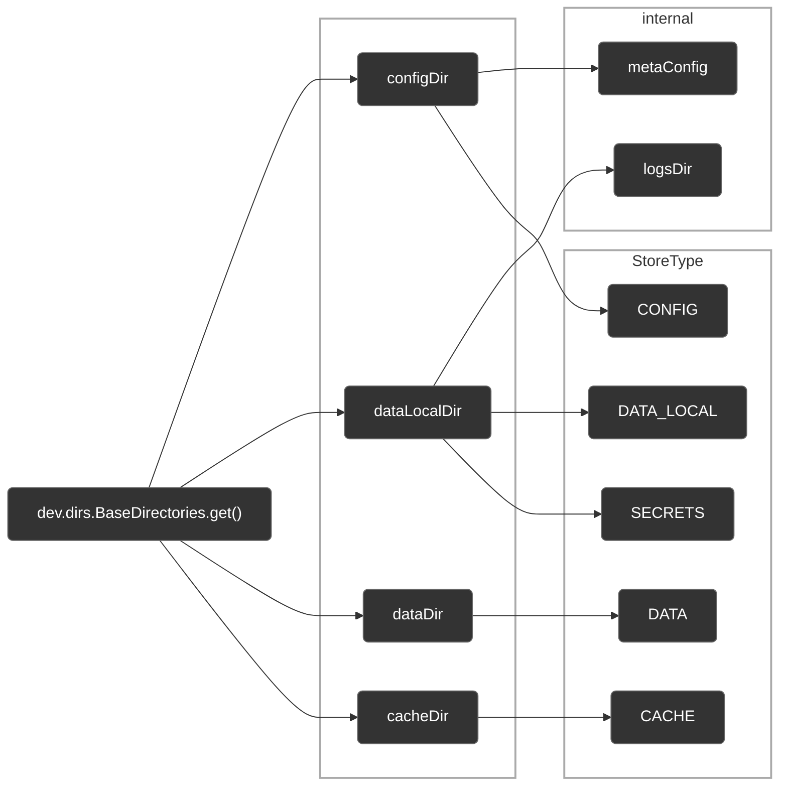

# System Storage Lib

一个 Minecraft 库模组，为其他模组提供**系统级持久化存储**，遵循各平台的数据目录约定，支持跨进程文件锁和加密凭据存储。

### 设计原则

- **有来有去**：确保用户可以干净地删除本库模组在系统中存放的所有文件
- **因盘制宜**：允许自定义大体积数据的存放位置，防止占用过多系统分区空间

System Storage Lib 从 [directories-jvm](https://github.com/dirs-dev/directories-jvm) 获取系统标准目录（`configDir`、`dataDir` 等），然后按 `StoreType` 在其下划分出五种用途的存储目录，外加 `metaConfig`（全局配置）和 `logsDir`（日志）两个内部目录。所有路径在构造 `SystemStorageLib` 单例时确定，不可自定义。

> [!Warning]
>
> 当前为不稳定的非正式版本。API 随时可能发生破坏性变更。

> [!Tip]
>
> 本文档旨在指导开发者如何使用 System Storage Lib，而非事无巨细地罗列 API。仅展示关键 API 方法，更多细节请参考源码。

---

- **许可证**: [MIT License](https://github.com/Leawind/SystemStorageLib/blob/main/LICENSE)
- **源码**: [GitHub - Leawind/SystemStorageLib](https://github.com/Leawind/SystemStorageLib)
